# golden-ai-slack-bot

A Slack bot that uses the OpenAI API to generate responses and images based on user prompts.

# Functions

Mention bot and ask the bot a question at channel. It will generate a response:
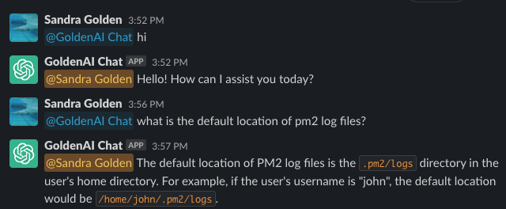

Directly have a conversion with the bot:
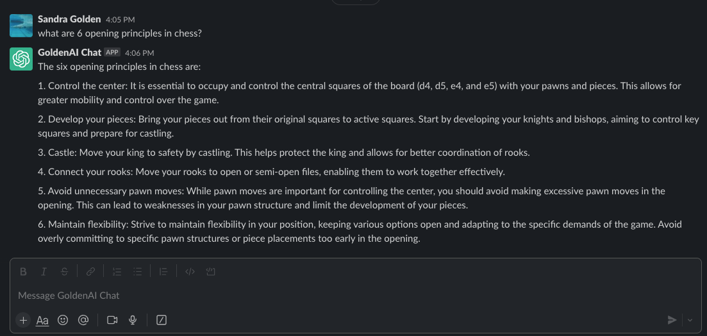

Generate an image based on a prompt:
```
/image [prompt]
```
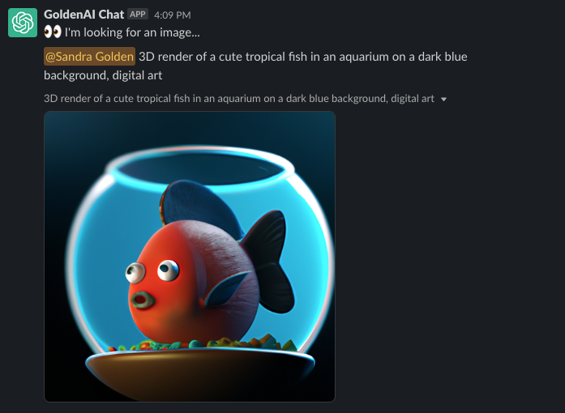

Generate a thought for the day:
```
/thought
```
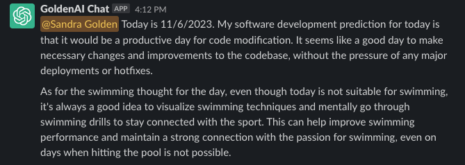

Summarize the thread:
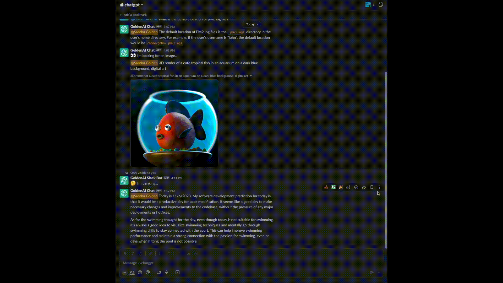

Ask a question based on the conversations in the thread:


# Prerequisites

## OpenAI

- Obtain an OpenAI API key.

## Slack

### App Manifest

```json
{
  "display_information": {
    "name": "GoldenAI Slack Bot",
    "description": "An OpenAI Slack Bot",
    "background_color": "#2c2d30"
  },
  "features": {
    "app_home": {
      "home_tab_enabled": false,
      "messages_tab_enabled": true,
      "messages_tab_read_only_enabled": false
    },
    "bot_user": {
      "display_name": "GoldenAI Chat",
      "always_online": true
    },
    "shortcuts": [
      {
        "name": "Summarize...",
        "type": "message",
        "callback_id": "summarize",
        "description": "Summarize this thread..."
      },
      {
        "name": "Ask something...",
        "type": "message",
        "callback_id": "ask",
        "description": "Ask the question in the thread"
      }
    ],
    "slash_commands": [
      {
        "command": "/image",
        "description": "Generate image from OpenAI",
        "usage_hint": "[a white siamese cat]",
        "should_escape": false
      },
      {
        "command": "/thought",
        "description": "Get the thought of the day",
        "should_escape": false
      }
    ]
  },
  "oauth_config": {
    "scopes": {
      "bot": [
        "app_mentions:read",
        "channels:history",
        "chat:write",
        "chat:write.customize",
        "chat:write.public",
        "commands",
        "files:write",
        "groups:history",
        "im:history",
        "users:read"
      ]
    }
  },
  "settings": {
    "event_subscriptions": {
      "bot_events": [
        "app_mention",
        "message.im"
      ]
    },
    "interactivity": {
      "is_enabled": true
    },
    "org_deploy_enabled": false,
    "socket_mode_enabled": true,
    "token_rotation_enabled": false
  }
}
```

### Create a Slack App

1. Create a new app and install it to your workspace through the [Slack API](https://api.slack.com/apps?new_app=1).
2. Select **From an app Manifest**, copy the JSON above. Click **Create**
3. On the `Install App` page, **Install to Workspace**:
   - 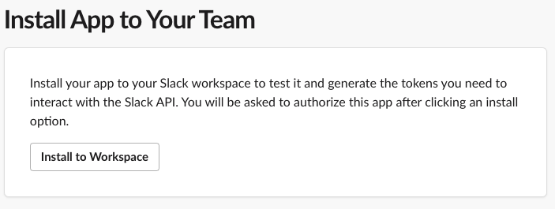
4. On the `Socket Mode` page, **Enable Socket Mode**:
   - 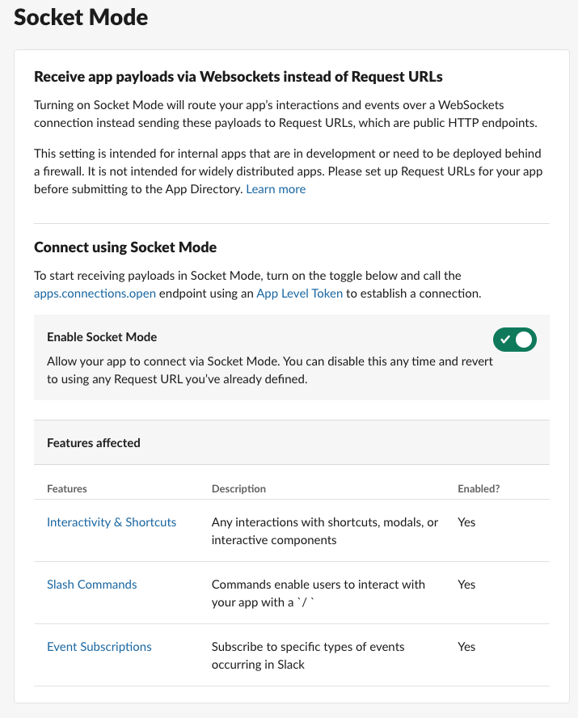
5. On the `OAuth & Permissions` page, add the following scopes to `Scopes > Bot Token Scopes`:
   - 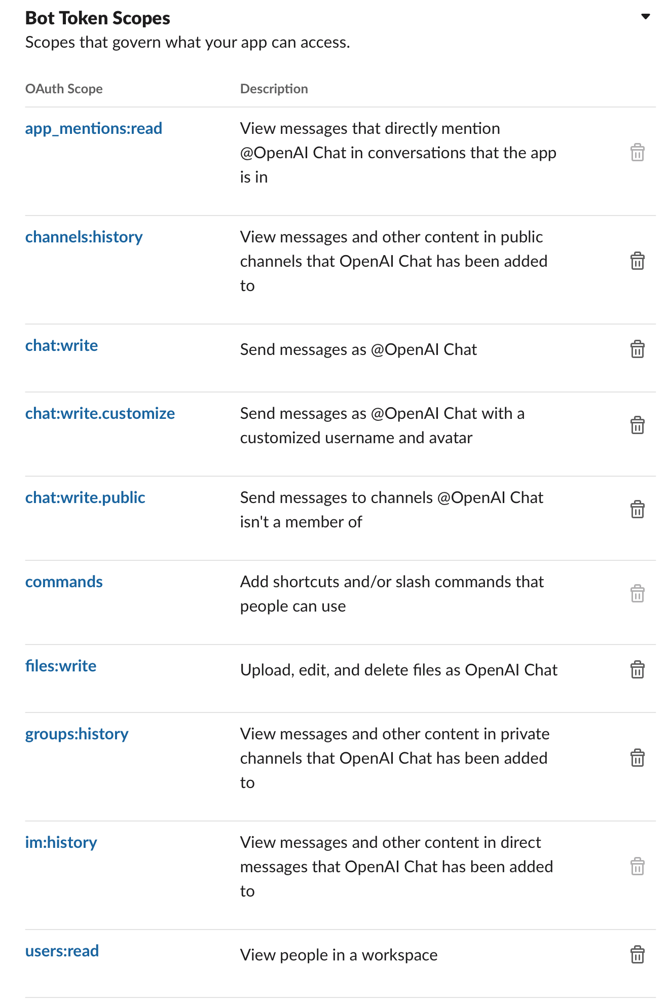
6. On the `Event Subscriptions` page, **Enable Events** and subscribe to the `app_mention` and `message.im` bot events:
   - 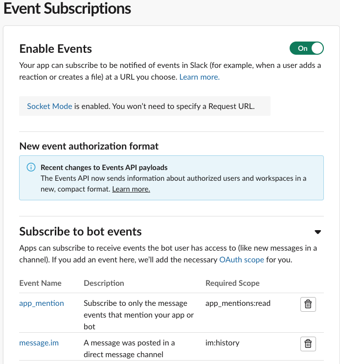
7. On the `Slash Commands` page, add the `/image` and `/thought` commands:
    - 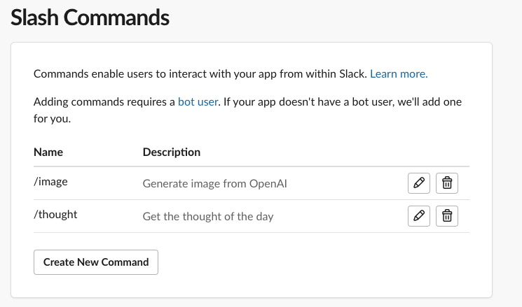
8. On the `Interactivity & Shortcuts` page, add the `ask` and `summarize` shortcuts:
    - 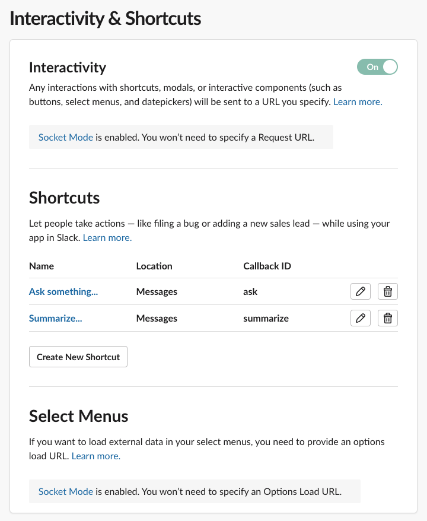
9. Obtain the following keys and add them to a `.env` file at the root of the project directory:
    1. Slack
        - `SLACK_SIGNING_SECRET`: found under **Basic Information** > **App Credentials** > **Signing Secret**
        - `SLACK_APP_TOKEN`: found under **Basic Information** > **App-Level Tokens**, click **Generate Token and Scopes** and name it `app-token`. Copy the generated token:
          - 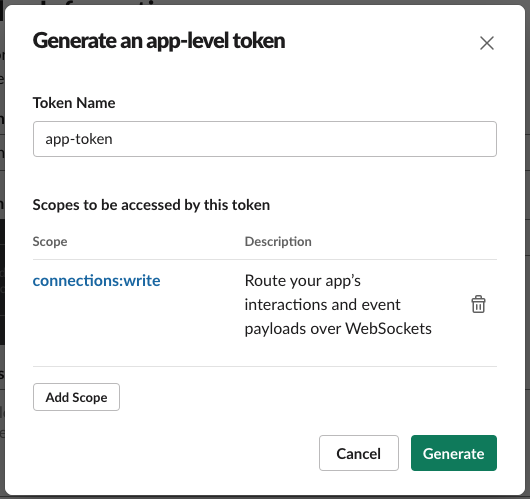
        - `SLACK_BOT_TOKEN`: found under **OAuth & Permissions** > **OAuth Tokens for Your Workspace** > **Bot User OAuth Token**
        - `SLACK_APP_MENTION_QUOTE_USER_MESSAGE`: If enabled, user's message will be added as quote before response message when you mention bot. Default value: `false`.
    2. OpenAI auth
      You can use different OpenAI providers by setting `AI_PROVIDER` to `openai` or `azure`. Each provider has different environment variables.
        1. OpenAI
            - `AI_PROVIDER=openai`
            - `OPENAI_API_KEY`: OpenAI API key
            - `OPENAI_API_BASE`: OpenAI API base path.
        2. Azure
            - `AI_PROVIDER=azure`
            - `AZURE_API_BASE`: Azure API base path
            - `AZURE_DEPLOYMENT_NAME`: Azure API deployment name
            - `AZURE_API_VERSION`: Azure API version
    3. Common OpenAI settings
        - `OPENAI_CHAT_MODEL`: Which chat model you want to use. See [available models](https://platform.openai.com/docs/models/overview). Default value: `gpt-3.5-turbo`.
        - `OPENAI_CHAT_ENABLE_SUMMARIZE`: If enabled, it will call OpenAPI chat completion to summarize previous conversations when number of messages cached >= `OPENAI_CHAT_NUM_OF_MESSAGES`. Default value: `false`.
        - `OPENAI_CHAT_NUM_OF_MESSAGES`: Number of messages bot will cache. It's used for appending previous conversations when calling chat completions API. MUST BE EVEN. Default value: `2`.
        - `OPENAI_CHAT_TTL`: The duration of time (second) that messages will be kept. Default value: null (keep forever).
        - `OPENAI_CHAT_SYSTEM_MESSAGE`: First message to help set the behavior of the assistant. Default value: null.

IMPORTANT: If you are using Azure as OpenAI provider, you cannot use `/image` command.

Your `.env` file should look like this:

```
AI_PROVIDER=openai
OPENAI_API_KEY=xxxxxxx
SLACK_BOT_TOKEN=xoxb-xxxxxxx
SLACK_SIGNING_SECRET=xxxxxx
SLACK_APP_TOKEN=xapp-xxxxxx
OPENAI_CHAT_MODEL=gpt-3.5-turbo
OPENAI_CHAT_ENABLE_SUMMARIZE=false
OPENAI_CHAT_NUM_OF_MESSAGES=4
OPENAI_CHAT_TTL=1200
OPENAI_CHAT_SYSTEM_MESSAGE="You are a helpful assistant."
```

# Getting Started

To get started with the bot, follow these steps:

1. Install the necessary dependencies by running `yarn install`
2. Start the bot by running `yarn start`

Alternatively, you can use docker by running `docker compose up`.

# Insights

golden-ai-slack-bot integrates Helicone to monitor their usage, latency, and costs of OpenAI API.

- 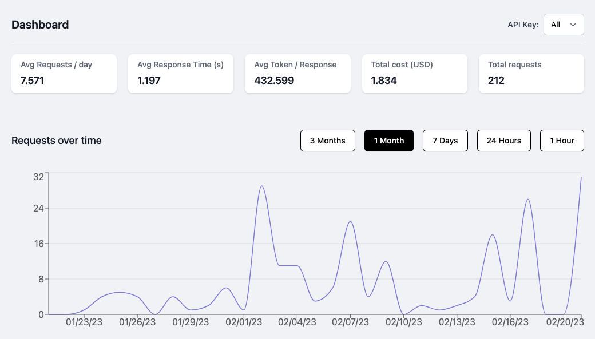
- 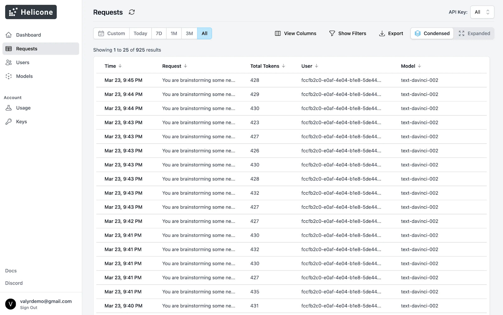

## Setup
1. Go to [Helicone.ai](https://www.helicone.ai/) and register an account if you don't have one.
2. On the `Keys` page, generate a new key and copy it.

To configure Helicone, you need to add the following environment variables:
```
OPENAI_API_BASE=https://oai.hconeai.com/v1
HELICONE_API_KEY=sk-helicone-xxxxxx
```
